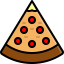

  

  <h3 align="center">Chat App</h3>

  

    Simple pet project of Chat App
     
    <a href="https://github.com/finalepta/vue-pizza"><strong>Explore the README »</strong></a>
     
     
    <a href="https://fastidious-caramel-a438c3.netlify.app">View Demo</a>
    ·
    <a href="https://github.com/finalepta/vue-pizza/issues">Report Bug</a>
    ·
    <a href="https://github.com/finalepta/vue-pizza/issues">Request Feature</a>
  

  
Table of Contents

  <ol>
    <li>
      <a href="#about-the-project">About The Project</a>
      <ul>
        <li><a href="#built-with">Built With</a></li>
      </ul>
    </li>
    <li>
      <a href="#features">Features</a>
    </li>
  </ol>

## About The Project

This is pet project for pizza shop. It is vue version of already existing react pizza shop. Reference: <a href="https://www.youtube.com/playlist?list=PL0FGkDGJQjJG9eI85xM1_iLIf6BcEdaNl ">playlist with videos</a>. Although it is not fully original, nothing except design and pizzas were taken :). Everything else is built by myself. 

This is frontend vue application which implements online shop. There are almost all features that are used in online shops nowadays: filtering by categories, sorting, search, adding items to cart, options for items. I think this project shows my capabilities to create larger online shops using vue framework. 

(<a href="#readme-top">back to top</a>)

### Built With

#### Front-end: 
* 
* 
*  as SCSS
* 

(<a href="#readme-top">back to top</a>)

## Features

* Built using Vue.js framework.
* Uses the Composition API for building components and managing state.
* Utilizes the Pinia store for managing the cart state across multiple components.
* Implements TypeScript for type-checking and improving code quality.
* Uses SCSS for styling the components and overall design.
* Implements the SVG sprite technique for displaying and managing SVG images.
* Uses Vue Router for handling the routing and displaying the pizza details page.
* Utilizes Axios for fetching data from the backend.
* Implements filtering and sorting functionalities for the pizza list.
* Implements increment and decrement functionalities for the pizza count in the cart.
* Implements remove and clear functionalities for the cart.
* Implements a responsive design that is optimized for mobile and desktop views.

(<a href="#readme-top">back to top</a>)

